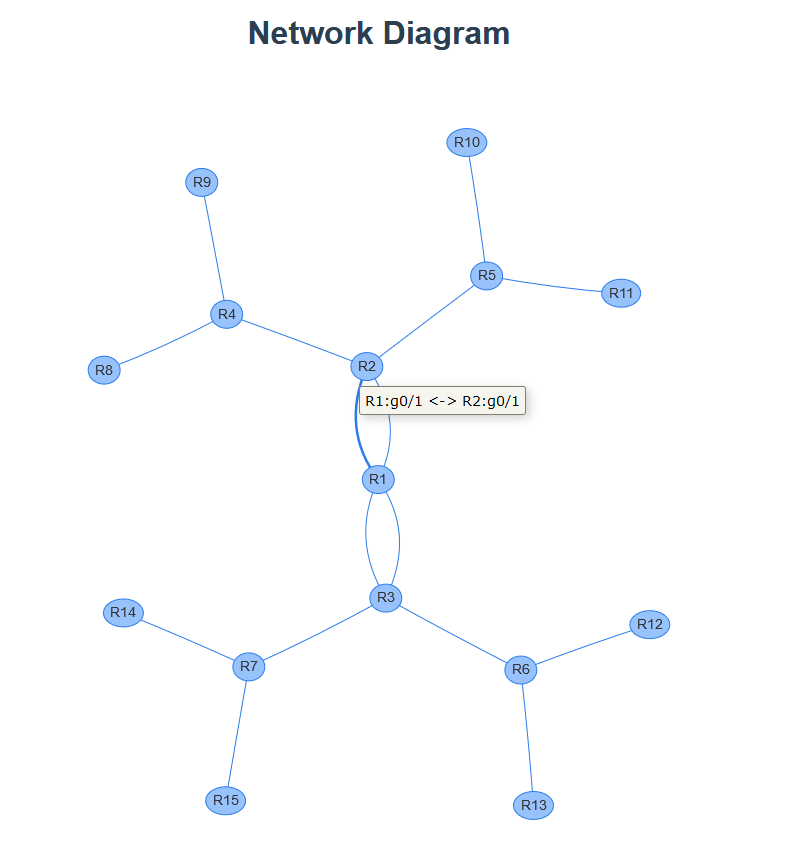

# Visualization of a network diagram using JavaScript
The project is using [Vue.js](https://vuejs.org/) as a front-end JavaScript framework and [vis-network](https://visjs.github.io/vis-network/docs/network/) framework for visualizing a network diagram (using [`vue-visjs`](https://github.com/sjmallon/vue-visjs) wrapper).  
My experience with JavaScript is very limited to recommend anything. But I've built one side project using Vue.js and I liked it a lot.  
As of February, 2020 you have several modern front-end frameworks to choose from:
* React
* Vue.js
* Angular

You can also use `jQuery` if you need to do something simple, but it is considered to be obsolete these days, mainly because JavaScript in all major browsers supports many features that `jQuery` was designed for. So if you have been considering `jQuery`, may be you could try solving your problem without frameworks at all using native JavaScript (so called VanillaJS). As a result, your page will be very fast.

Unfortunately on the stream my lack of JS experience was a big obstacle in getting any result and I barely made any progress live. However, after the stream I continued experimenting and got to a decent result.  
The original idea was to visualize a network diagram but have it interactive so a user can drag and drop nodes, and front-end will save those coordinates (either in local storage or ideally on the back-end via API). So when the topology is opened again, the nodes are in their previous positions.  
After playing more with `vis-network`, I've found that it has many cool features, but most importantly it has a decent node placement algorithm (called [hierarchical layout](https://visjs.github.io/vis-network/docs/network/layout.html)) which creates a beautiful diagram without any manual coordinates (though you can do that do if you want a complete control over your diagram!). For production I will still need to play with different options, but even this result is quite decent.  
Here is the diagram I've got (and you can get it too by following instructions below):

## Repository
* `src` contains the source code of Vue application
 * `src/router/index.js` is a `vue-router` config, e.g. `/diagram` url will invoke `NetworkDiagramView`
 * `src/views/NetworkDiagramView.vue` is the view with the diagram importing `NetworkDiagram.vue` component
 * `src/components/NetworkDiagram.vue` is the main component with contains everything related to drawing the diagram. Make your changes here!
 * `src/components/NetworkDiagramD3Force.vue` is an alternative drawing framework which uses [`d3-force`](https://github.com/d3/d3-force) library (using `vue-d3-network` wrapper) which simulates particles movement. I've explored this on the stream, but I didn't find it very appealing.

## Instructions
I've been using node.js v13.8.0 (installed using [nvm](https://github.com/nvm-sh/nvm)) and dependencies are installed using [yarn](https://github.com/yarnpkg/yarn)
1) In the project folder (with the file `yarn.lock`) use `yarn install` to install dependencies
2) Run development server using `yarn serve`. It will be available at http://localhost:8080
3) Explore the diagram on the **Diagram** page
4) Change different options (consult `vis-network` [docs](https://visjs.github.io/vis-network/docs/network/)) or add nodes/edges  in `src/components/NetworkDiagram.vue` and see how the diagram is changing (sometimes you need to do `yarn serve` to re-trigger the build)
5) To build a static website which can be served using a web server (e.g. `nginx`), use `yarn build`. The resulting static website will be in `dist/` folder.

### Streams
* Visualizing a network diagram with JavaScript | stream 2020/02/16: [https://youtu.be/JOcWC9PPjSQ](https://youtu.be/JOcWC9PPjSQ)
